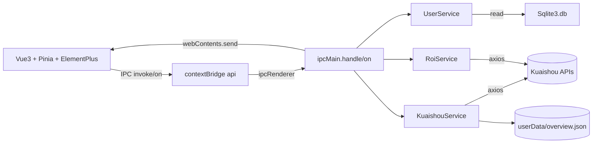

```mermaid
flowchart LR
  Renderer[Vue3 + Pinia + ElementPlus] -- IPC invoke/on --> Preload[contextBridge api]
  Preload -- ipcRenderer --> MainIPC[ipcMain.handle/on]
  MainIPC --> UserService
  MainIPC --> KuaishouService
  MainIPC --> RoiService
  UserService -->|read| Sqlite3[Sqlite3.db]
  KuaishouService -->|axios| KuaishouAPI[(Kuaishou APIs)]
  RoiService -->|axios| KuaishouAPI
  KuaishouService --> OverviewRepo[(userData/overview.json)]
  MainIPC -- webContents.send --> Renderer
```

说明：
- 事件名与载荷遵循 `electron-ks` 原协议（`users_data|kuaishou_data|roi_data|update_roi_result|error`）。
- 数据持久化：用户库随安装包提供；概览历史保存在用户数据目录。
